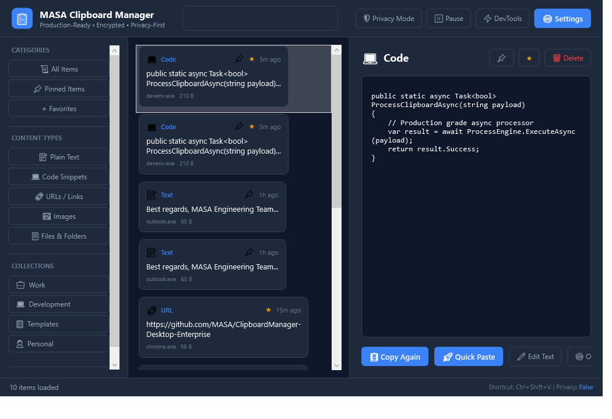
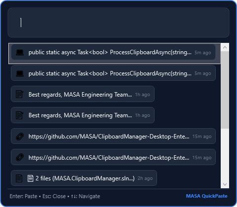
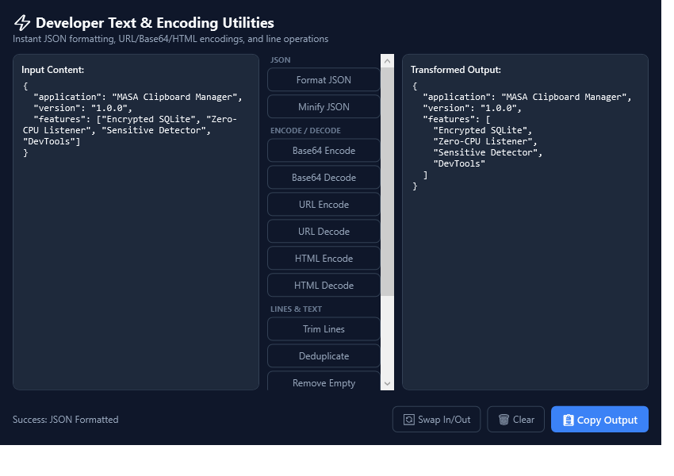
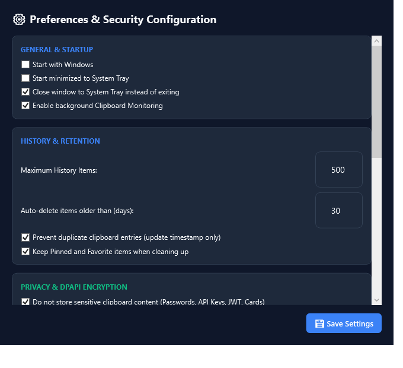
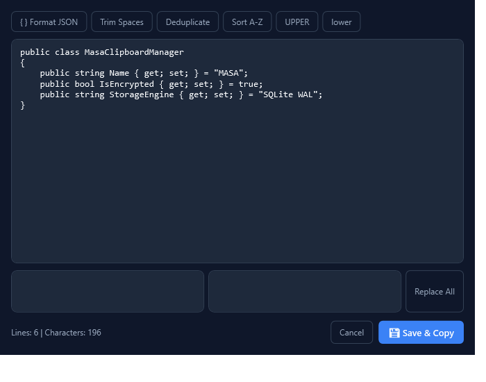

# Screenshots — MASA Clipboard Manager

This directory contains actual, pixel-perfect UI screenshots captured directly from the running WPF application.

---

### 1. Main Dashboard

*Features: Global Search, Live Filter Tabs, Custom Collections Sidebar, Encrypted Items List, Detail & Actions Pane.*

---

### 2. Quick Paste Overlay (`Ctrl+Shift+V`)

*Features: Floating top-most popup, Instant search, Arrow keys navigation, 1-9 direct paste keys, Enter to simulate paste.*

---

### 3. Developer Utilities Workbench

*Features: JSON Format & Minify, Base64/URL/HTML Encode & Decode, Line Deduplication & Sorting.*

---

### 4. Preferences & Security Configuration

*Features: Windows DPAPI encryption settings, Retention policies, Sensitive Data automatic deletion, and Application Exclusions.*

---

### 5. In-App Snippet Editor

*Features: Quick transformations, Find/Replace, Real-time line/character stats, and Save & Re-copy.*
